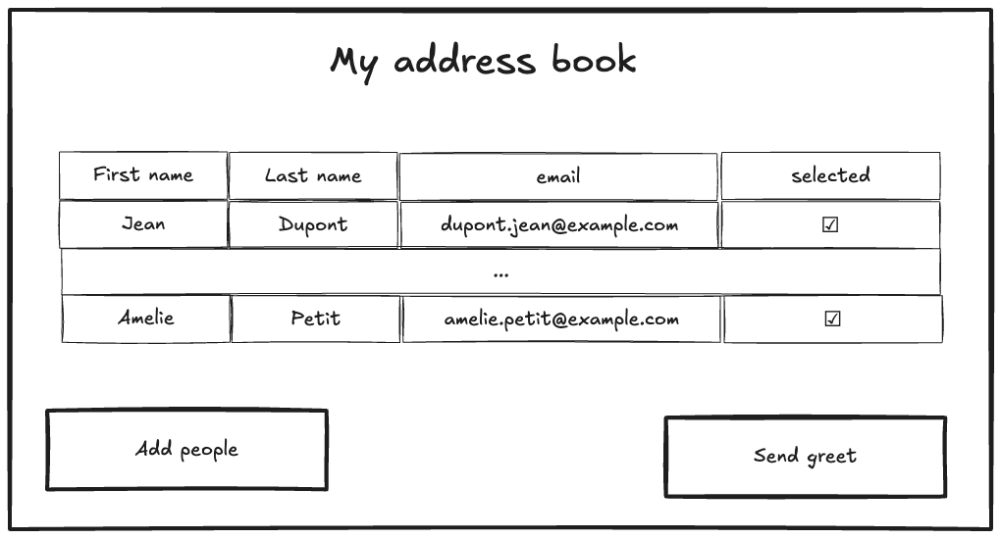
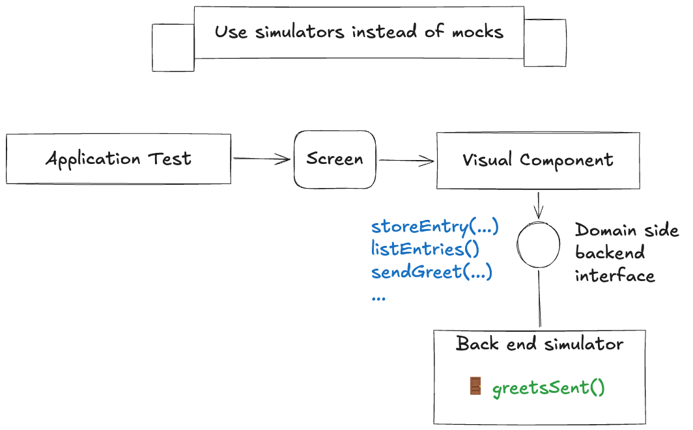

♿️ Access Driven Development Kata
====

This kata is designed to practice TDD on an accessible way by following the testing-library guidelines.

The goal is to learn testing and accessibility by building test a simple accessible greeting application with testing-librairy.

The application allows you to add entries in your address book and send a customizable greet message to them.  

You can refer to https://www.w3.org/WAI/ARIA/apg/patterns/ for accessibity concept.

## Testing library priority guidelines 

According to [👉🏼 testing-library recommendation](https://testing-library.com/docs/queries/about/#priority.), use as much as possible this priority
order while accessing your application : 

1. Queries Accessible to Everyone
2. Semantic Queries HTML5 and ARIA
3. (Test IDs) ?

## Example of the application (for inspiration):

##  Some useful tips for testing without mocks

