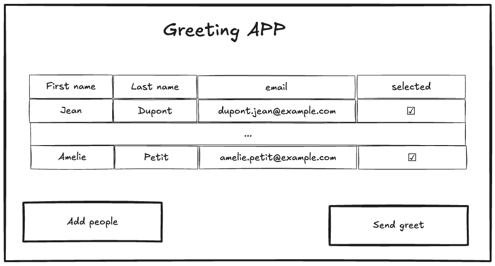
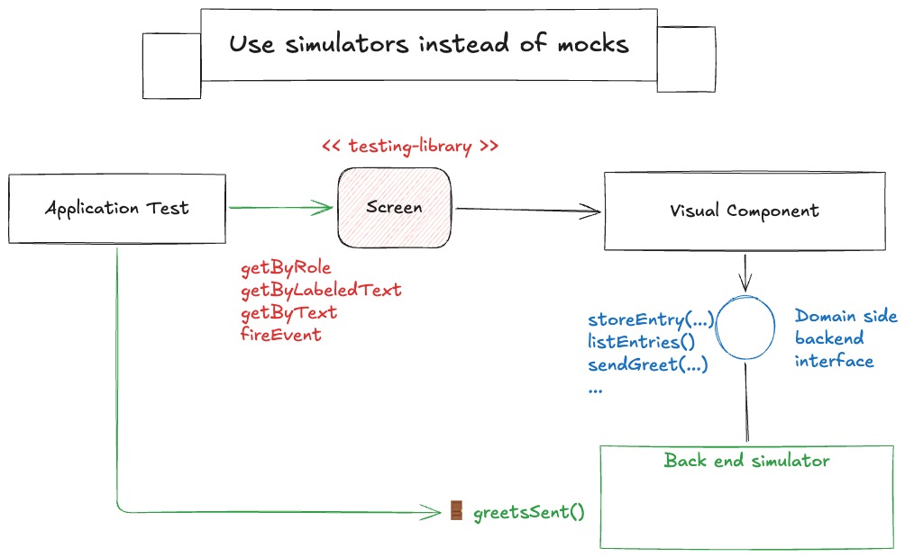

♿️ Access Driven Development Kata
====

This kata is designed to practice TDD on an accessible way by following the testing-library guidelines.

The goal is to learn testing and accessibility by building test a simple accessible greeting application with testing-librairy.

The application allows you to add entries in your address book and send a customizable greet message to them.  

You can refer to https://www.w3.org/WAI/ARIA/apg/patterns/ for accessibity concept.

## Testing library priority guidelines 

According to [👉🏼 testing-library recommendation](https://testing-library.com/docs/queries/about/#priority.), use as much as possible this priority
order while accessing your application : 

1. Queries Accessible to Everyone
2. Semantic Queries HTML5 and ARIA
3. (Test IDs) ?

## Example of the application (for inspiration):

##  Some useful tips for testing without mocks

## References

 - prefer using get... instead of query... to have better feedback when control is not found ([see testing librairy queries](https://testing-library.com/docs/queries/about/))
 - [How to properly handle inline error messages while the user is typing (ARIA)?](https://stackoverflow.com/questions/71615554/how-to-properly-handle-inline-error-messages-while-the-user-is-typing-aria)

## Some tips for mac-OS users

 - shortcut to activate voice over : `cmd + F5`
 - to interact with dialog, use `ctrl + option + arrow left/right` to navigate through controls and `ctrl + option + space` to activate selected control.
 - to list all actions use `Ctrl + option + U`
 - to turn on/off keyboard help `Ctrl + option + K`
 - to turn on/off vocalisation go to VoiceOver Utility > Speech > Disable speech

## Guided kata instructions

### Application title
 - Write a test to check the page contains a title "Greeting App" with getByRole
 - Execute the test and check it fails. Pay attention on the failure message. 
   - Which feedback is given to you by testing library ?
   - How can you use this feedback to fix your test ?
 - Write the code to make the test pass.
 - Everything is green, you can commit before playing with the next step.

### Play with testing library query
 - Duplicate the title in the component with the same text "Address Book" and run the test again.
   - Does your test still green ? Why ?
 - Rewrite your test using getAll... instead of getBy...
   - Does your test still green ?
   - What is the difference between getBy and getAllBy ?
   - In an accessible point of view : How do you feel with the feedback given when your test fails when more than one matching element is found ?
 - Revert your code to have only one title checked by getByRole.

### table and header
 - Write a test ensuring a table with the accessible name 'Address Book entries' is displayed.
 - Make the test pass.
 - Questions : 
   - Which strategy do you use to make table labeled ?
   - Find two other ways to label the table ? What are the pros and cons of each strategy ? (indice : aria-label, aria-labelledby, caption)
 - Complete this test to check the table includes the column headers "First name", "Last name", "Email" and "Selected"

### (optional) write send greeting simulator  

### Fill with data
 - Write a new test that uses the SendGreetingSimulator to populate two entries, then verify the table displays them correct
 - Questions : 
   - How does a screen reader describe your application ?
   - Is it easy to understand what is displayed ?
   - How improve accessibility ?

### add entry

### send greet

### debrief
 - Look at your tests. 
   - How do they describe application behavior ? How can you improve their readability ?
   - Do you feel confident to add functionnality without introduce regression ?
   - Did you experience an unexpected red phase?
 - What are your feeling about accessibility ?
   - Did you try a screen reader ?
   - Did you meet surprising difficulty or ease ?

Clues : 
 - Adapter contract testing
 - Page object
 - 